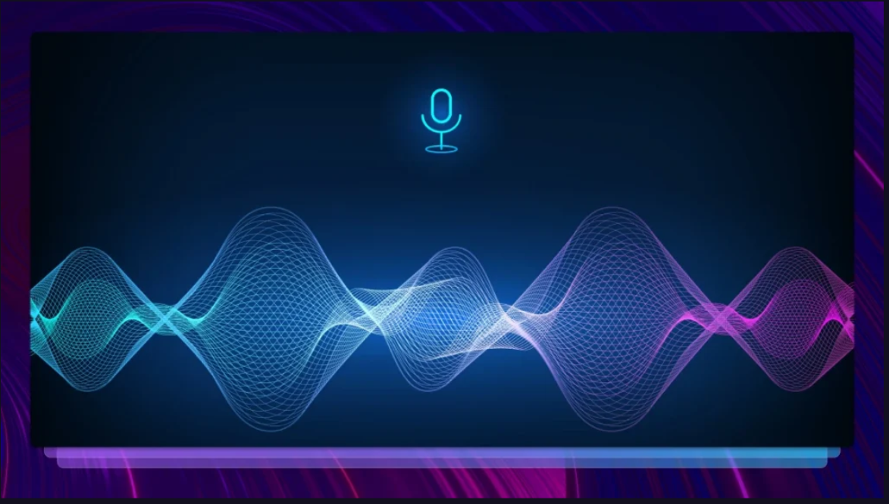
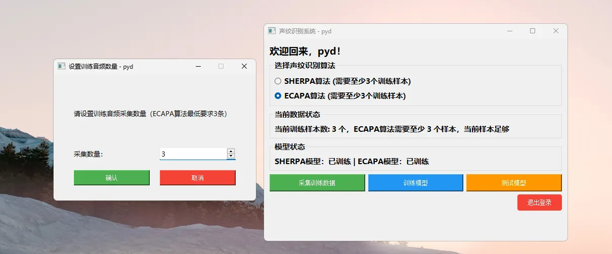
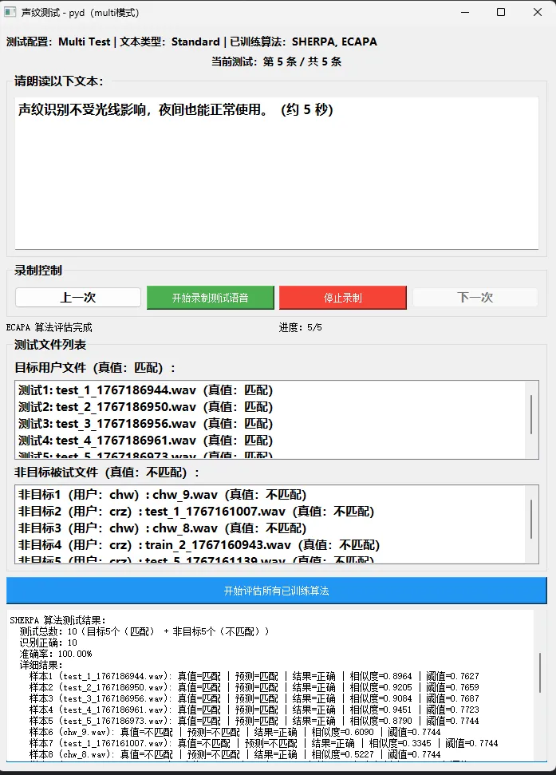

# 声纹识别系统
一款功能全面、易用性强的声纹识别系统，支持 SHERPA 和 ECAPA 两种主流算法，覆盖训练数据采集、模型训练、多模式测试/评估全流程，并提供直观的图形用户界面（GUI），降低操作门槛。



## 项目概述
本系统通过全图形化界面简化声纹识别任务，核心能力包括：
- 配置训练音频样本数量
- 选择两种业界主流的声纹识别算法（SHERPA/ECAPA）
- 采集语音数据用于模型训练
- 一键完成模型训练
- 对训练后的模型进行批量测试和量化评估
- 生成包含核心指标的详细评估报告

## 核心特性
- **训练样本配置**：自定义设置训练音频样本数量（两种算法均要求最少 3 个样本）。
- **算法选择**：支持两种互补性强的主流声纹识别算法，适配不同场景需求。
- **实时状态监控**：即时显示训练样本数量，并验证样本是否满足所选算法的要求。
- **简化的模型管理**：一键完成训练数据采集、模型训练、模型测试核心操作。
- **多模式测试**：支持「批量测试」模式，实现批量声纹验证。
- **全面的算法评估**：自动生成详细报告，包含匹配结果、相似度得分、阈值、准确率等指标。

## 支持的算法
| 算法 | GitHub 仓库  | 最低训练样本数 | 核心能力 |
|------|--------------|----------------|----------|
| SHERPA | [https://github.com/k2-fsa/sherpa-onnx](https://github.com/k2-fsa/sherpa-onnx) | 3 | 鲁棒的声纹特征提取与匹配 |
| ECAPA | [https://github.com/speechbrain/speechbrain](https://github.com/speechbrain/speechbrain) | 3 | 高精度的说话人验证 |

## 环境配置
本项目基于 Python 3.10.14 开发，按以下步骤安装依赖：

### 步骤 1：创建 `requirements.txt` 文件
新建文件 `requirements.txt`，写入以下内容：
```txt
numpy==1.26.4
pyaudio==0.2.14
PyQT5==5.15.11
librosa==0.11.0
sherpa-onnx==1.12.20
sounddevice==0.5.3
soundfile==0.12.1
speechbrain==1.0.3
pypinyin==0.55.0
loguru==0.7.2
torch==2.1.1+cu121
torchaudio==2.1.1+cu121
```

### 步骤 2：安装依赖包
在终端执行以下命令（确保已安装 Conda）：
```text
# 创建 Conda 环境
conda create -n voice_system python=3.10.14 -y
# 激活环境
conda activate voice_system
# 安装依赖
pip install -r requirements.txt
```

> Note: 注意：若 pyaudio 安装失败（Windows/macOS 常见）：
> - macOS：先执行 brew install portaudio 安装 PortAudio，再重新安装 pyaudio。
> - Windows：执行 pip install pipwin && pipwin install pyaudio 安装预编译包。
> - Linux：执行 sudo apt-get install portaudio19-dev 安装 PortAudio 开发库，再重新安装 pyaudio。

## 使用流程
### 步骤 1：配置训练样本数量
1. 从主界面打开「设置训练音频数量」窗口。
2. 输入训练样本数量（≥3），点击「确认」保存配置。
3. 点击「取消」可放弃本次配置。

### 步骤 2：采集训练数据
1. 在主界面下拉框选择目标算法（SHERPA/ECAPA）。
2. 点击「采集训练数据」，按照屏幕提示录制语音样本。

### 步骤 3：训练模型
1. 确认训练样本数量满足最低要求（≥3）。
2. 点击「训练模型」，系统自动为所选算法训练模型。
3. 训练完成后，界面显示「已训练」状态。

### 步骤 4：测试模型
1. 切换至「批量测试」模式，进行批量声纹验证。
2. 按照提示朗读指定文本（每次测试约 5 秒），通过「开始录制测试语音」/「停止录制」采集音频。
3. 用「上一个」/「下一个」按钮切换测试项。

### 步骤 5：评估算法
1. 完成测试音频录制后，点击「开始评估所有已训练算法」。
2. 系统生成详细评估报告，包含：
  - 目标用户文件匹配结果（True = 匹配）
  - 非目标用户文件匹配结果（True = 不匹配）
  - 算法准确率（如测试用例中达 100.00%）
  - 详细指标：相似度得分、阈值、结果正确性

### 注意事项
1. SHERPA 和 ECAPA 算法均要求至少 3 个训练样本，样本不足时系统会给出提示。
2. 为保证最优识别准确率，请按屏幕提示控制测试音频时长（约 5 秒 / 次）。
3. 评估报告同时包含定性（匹配 / 不匹配）和定量（相似度 / 阈值）指标，便于调试优化。

## 界面预览
### 主界面
- 算法选择下拉框（SHERPA/ECAPA）
- 数据 / 模型状态实时显示
- 核心操作按钮：采集训练数据 / 训练模型 / 测试模型



### 测试界面
- 批量测试配置面板
- 录制控制按钮：开始 / 停止 / 上一个 / 下一个
- 测试 / 评估结果详细列表



### 许可证
本项目采用 MIT 许可证开源 - 详见 LICENSE 文件。

```text
MIT 许可证

版权所有 (c) 2026 声纹识别系统贡献者

特此授予任何获得本软件及相关文档文件（以下简称“软件”）副本的人无限制处置该软件的权利，
包括但不限于使用、复制、修改、合并、发布、分发、再许可和/或销售该软件副本的权利，
并允许向其提供该软件的人做出上述行为，但须符合以下条件：

上述版权声明和本许可声明应包含在该软件的所有副本或主要部分中。

本软件按“原样”提供，不附带任何形式的明示或暗示的保证，
包括但不限于对适销性、特定用途适用性和非侵权性的保证。
在任何情况下，作者或版权持有人均不对因使用本软件而产生的任何索赔、损害或其他责任
承担责任，无论是因合同、侵权或其他方式引起的，均与本软件的使用或其他交易无关。
```